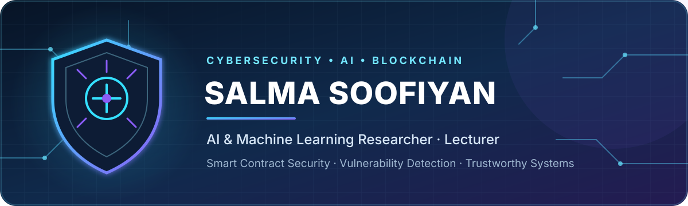

  

### Building secure, intelligent, and trustworthy digital systems

---

## About Me

I am a **Cybersecurity, Artificial Intelligence, and Machine Learning researcher and lecturer** based in London. My research focuses on applying intelligent methods to real-world security challenges, particularly **Ethereum smart contract vulnerability detection**, blockchain risk analysis, anomaly and intrusion detection, fraud detection, and secure access-control systems.

My work spans the full research and development lifecycle: from data preparation and machine learning model design to empirical evaluation, EVM-based smart contract testing, academic publishing, and postgraduate supervision. I am especially interested in building digital systems that are **secure, resilient, explainable, and trustworthy by design**.

- 🔐 Researching AI-driven cybersecurity and smart contract security
- ⛓️ Analysing Ethereum and EVM-based vulnerabilities
- 🤖 Building models for anomaly, intrusion, and fraud detection
- 🎓 Teaching and supervising postgraduate research in AI, data science, cybersecurity, and blockchain
- 🌱 Exploring trustworthy AI and policy-driven security controls for FinTech

## Research Focus

| Area | Current interests |
|---|---|
| **Smart Contract Security** | Vulnerability detection, mitigation, static analysis, deployment gating |
| **AI for Cybersecurity** | Intelligent threat identification, risk analysis, trustworthy AI |
| **Network Security** | Anomaly detection, intrusion detection, secure access control |
| **Blockchain & FinTech** | Ethereum, EVM security, decentralised systems, financial security |
| **Applied Machine Learning** | Predictive modelling, empirical evaluation, explainability |

## Tech Stack

### Languages

### Security, Blockchain & Data

## Experience Snapshot

- **AI & Machine Learning Researcher / Lecturer** — University of East London, 2021–Present
- **Web Developer** — University of East London, 2021–2023
- **Lecturer** — Payam-E-Noor University & University of Elmi Karbordi, 2015–2019
- **Volunteer Instructor** — Behzisti Welfare Organization, 2013–2015

## Selected Research & Publications

- **Ethereum Smart Contracts: A Hierarchical Analysis of Vulnerability Challenges and Mitigation Strategies** — *Cluster Computing, Springer Nature (2025)*
- **S3-Guard: Semantic, Static, and Structural Guard for Smart Contracts** — *IET Blockchain, forthcoming*
- **Enhancing Smart Contract Security: Static Heuristics and CodeBERT Embeddings** — *Conference paper (2025)*
- **Beyond Detection: Policy-Driven Dynamic Deployment Gating for Smart Contracts** — *Conference paper (2026)*
- **Uncertainty-Certified Economic Control for Smart Contract Deployment** — *Under review*
- **Innovative Health Technology Assessment Tools** — *Medical Oncology Compendium, Elsevier (2025)*

## Education

- **PhD in Computer Science** — University of East London, 2023–2026  
  *AI-driven cybersecurity, Ethereum smart contract vulnerability detection, and blockchain security*
- **MSc in Computer Science (Artificial Intelligence)** — University of East London, 2020–2021
- **MSc in Mechatronics Engineering** — Islamic Azad University of Tehran, 2012–2015
- **BSc in Electrical & Electronics Engineering** — Islamic Azad University of Tehran, 2007–2011

## Highlights

- 🏆 Outstanding Long Service Award — University of East London
- 🎤 Invited international speaker — 23rd Brazilian Congress of Cancerology
- 📝 Invited academic peer reviewer — ICASA Conference
- 👑 Selected to present project work to **King Charles III** during UEL's 100-year anniversary
- ☁️ Microsoft Certified: **Azure AI Fundamentals**
- 🔗 Completed the **Chainlink Smart Contracts / Web3 Bootcamp**

---

### Let's build secure, resilient, and trustworthy technology.

📫 **[Email](mailto:salma.soofiyan@gmail.com)** · 💼 **[LinkedIn](https://www.linkedin.com/in/salma-soofiyan-92033011b/)**

